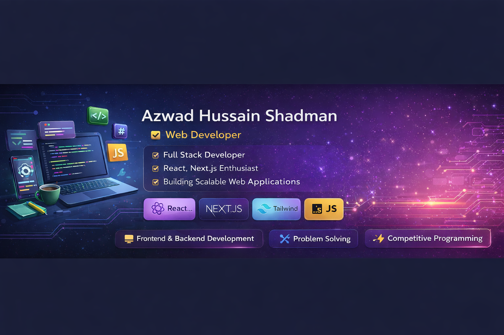

# 👋 Hi, I'm Azwad Hussain Shadman  

💻 Web Developer | ⚡ Problem Solver  

---

## 🚀 About Me
I am a passionate **Web Developer** focused on building modern, scalable, and user-friendly web applications.  
I enjoy working with **React and Next.js**, and continuously improving my skills in both frontend and backend development.

- 🌱 Currently learning: **Next.js & Full Stack Development**
- 💼 Working on: **Modern Web Applications**
- ⚡ Also experienced in **Competitive Programming**
- 🎮 Built a 2D game using **C/C++ & raylib** (side project)

---

## 🛠️ Tech Stack

### 💻 Languages
- C  
- C++  
- JavaScript  

### ⚙️ Frontend
- React.js  
- Next.js  
- Tailwind CSS  

### 🧰 Tools & Concepts
- Git & GitHub  
- REST API  
- OOP  
- Problem Solving  

---

## 🎯 Current Focus
- 🚀 Building scalable apps with **Next.js**
- 🌐 Improving frontend UI/UX skills
- 🧠 Practicing Data Structures & Algorithms

---

## 📌 Featured Projects
- 🌍 **Tourism Website**  
  A responsive web application built with React and Tailwind CSS.

- 🛒 **Modern Web App**  
  Focused on clean UI, performance, and user experience.

---

## 🧠 Skills
- Problem Solving  
- Clean Code Practices  
- Responsive Design  
- Debugging  

---

## 🌐 Connect With Me

  
  

---

## 📊 GitHub Stats

---

## ⚡ Developer Mindset
I focus on building **real-world web applications**, writing **clean and maintainable code**, and continuously learning new technologies to grow as a developer.
